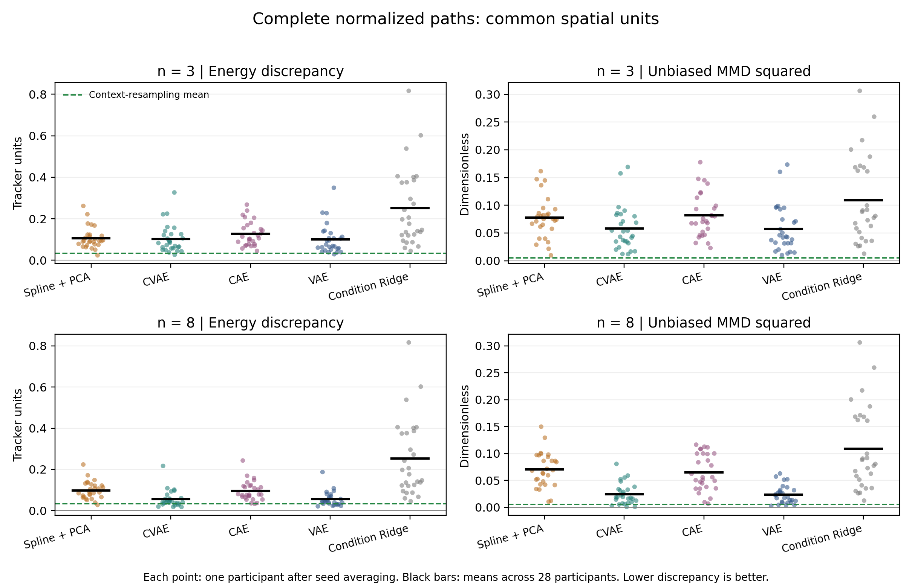
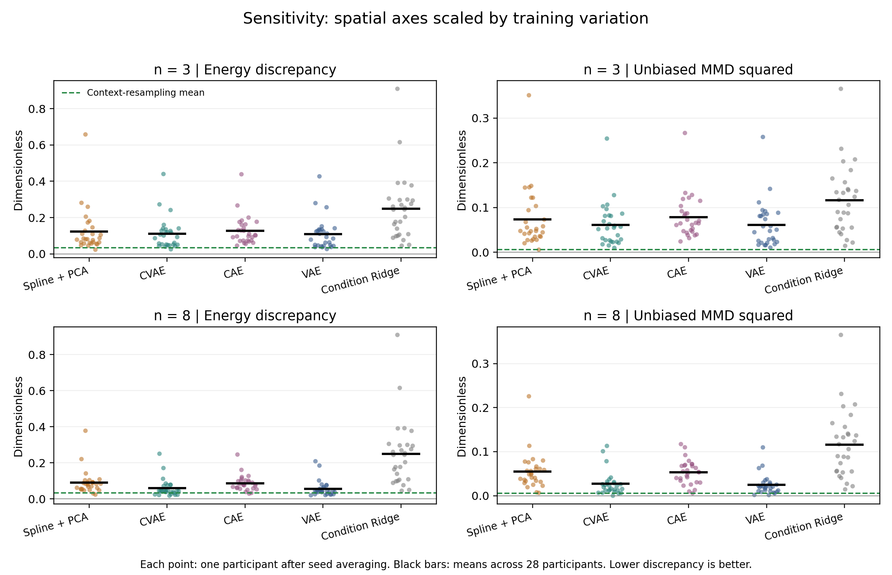
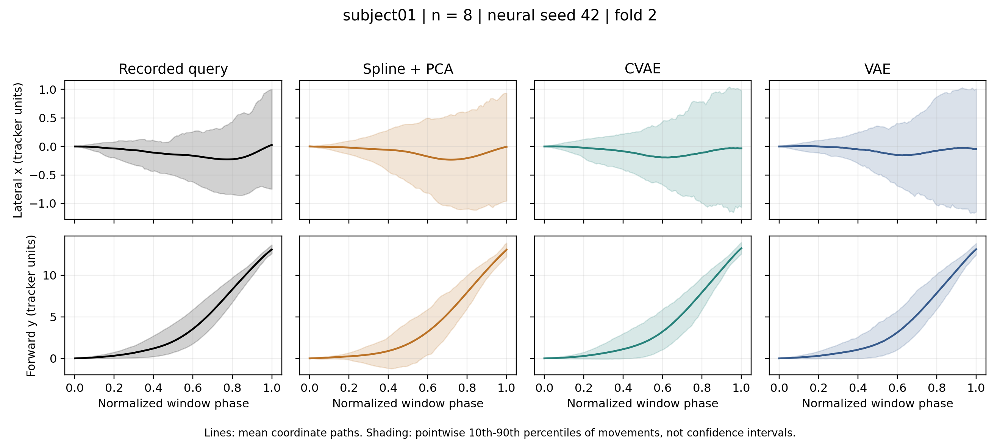

# Full-trajectory distribution follow-up

13 September 2026. Separate exploratory analysis of the frozen models, requested
after the laboratory report was completed. This work does not edit the 31-page
report, Paz's drafts, earlier scores or dashboard. Paz independently updated the
presentation in commit `ac8374b` while this analysis was being finalized; that
commit was incorporated unchanged and reviewed separately.

## Main result

At eight latent dimensions, VAE and CVAE generated distributions of complete
normalized trajectories closer to the recorded query distributions than spline
+ PCA on both evaluated distribution endpoints. These advantages survived BH
and Holm adjustment over all 80 declared comparisons and remained under the
alternative spatial-axis scaling. VAE had the lowest cohort means, but the new
comparisons did not establish a VAE-CVAE difference. This is not an equivalence
test and does not establish that the two generators are interchangeable.

Resampling the person's stored context trajectories achieved lower average
discrepancies than any compact model. It retains the full context recordings
and produces copies of them, so it is a nonparametric reference rather than an
n-number representation. The result limits claims about the benefit of learning:
the neural models compare favorably with the compact spline baseline on these
generation endpoints, not with every method allowed access to the context.

## What was compared

Each generated path was compared with every recorded query path. Distances
within the recorded set and within the generated set were also included. There
is no artificial one-to-one matching of generated and recorded trials.

The input to this analysis was the complete ordered 100 x 2 go-window path,
from target-motion onset to the final tracker sample, in the same translated
coordinate representation as reconstruction. The analysis introduces no new
crop, filter, time warping or shape alignment. It assesses normalized progression
and spatial coordinates, not durations in seconds or the preceding target-
appearance interval. The existing timing/feature evaluations remain necessary.

For the primary geometry, a path is flattened and divided by sqrt(200).
Euclidean distance between these vectors is therefore the root mean coordinate
squared difference between paths. Both spatial axes retain their common tracker
units. This does not discard temporal order: every phase point occupies a fixed
position in the vector.

Energy discrepancy is twice the mean between-set Euclidean distance minus the
two within-set mean distances, including diagonal zeros. It is not square-rooted
and uses Euclidean rather than squared Euclidean distances. RBF MMD squared
excludes within-sample kernel diagonals; this unbiased estimator can be negative
at finite sample sizes. Its bandwidth was fixed separately in each training fold
using the median positive squared distance among up to 512 deterministic training
paths. No query trajectories were used to select the distance scale or bandwidth.

The sensitivity geometry scales each axis by its training RMS deviation from
the training mean path before computing the same statistics. It uses one scale
per axis, not a separate scale near every phase point. This checks whether the
larger spatial variation of one axis determines the result. Raw and scaled
energy values have different units and should not be compared numerically.
Neither trajectory metric is numerically comparable with the earlier feature
metric of the same name: their input spaces and bandwidths differ.

## Primary results

Participant means after averaging available seeds; 28 equally weighted
participants in each row. Lower is better. Energy is in tracker units and MMD
squared is dimensionless. The same condition-only result is shown once.

| Model | n | Energy discrepancy | MMD squared |
|---|---:|---:|---:|
| Spline + PCA | 3 | 0.106772 | 0.077684 |
| CVAE | 3 | 0.102368 | 0.057768 |
| CAE | 3 | 0.127181 | 0.081831 |
| VAE | 3 | 0.100478 | 0.057186 |
| Spline + PCA | 8 | 0.098113 | 0.070464 |
| CVAE | 8 | 0.054924 | 0.024419 |
| CAE | 8 | 0.094698 | 0.065199 |
| VAE | 8 | 0.054768 | 0.023808 |
| Condition-only Ridge | - | 0.252014 | 0.109010 |
| Context resampling, retains full paths | - | 0.032847 | 0.005407 |
| Context mean repeated, no variation | - | 0.462058 | 0.245241 |



At n=8, CVAE improved over spline on energy for 26/28 participants and on MMD
for 26/28. VAE improved on energy for 25/28 and MMD for 26/28. The four raw-geometry
comparisons had BH-adjusted p-values below 2e-6 and Holm-adjusted p-values below
2.2e-5. The VAE-CVAE comparisons were not significant (energy BH p=0.6725;
MMD BH p=1.0000). Training sets overlap, so these exploratory paired-test results
retain the dependence limitations of the original study.

At n=3, the comparison was less robust: neither variational model's energy
advantage over spline survived BH adjustment. Both had lower raw-geometry MMD
after BH and Holm (BH p=0.001839, Holm p=0.036336), but those MMD advantages did
not survive BH under the axis-balanced geometry. Thus the robust n=8 result
should not be generalized to the three-number setting.

## Spatial-scaling sensitivity

| Model | n | Axis-balanced energy | Axis-balanced MMD squared |
|---|---:|---:|---:|
| Spline + PCA | 8 | 0.091167 | 0.054454 |
| CVAE | 8 | 0.059435 | 0.027013 |
| CAE | 8 | 0.086562 | 0.053060 |
| VAE | 8 | 0.056852 | 0.024336 |
| Condition-only Ridge | - | 0.248770 | 0.115988 |
| Context resampling | - | 0.033923 | 0.005632 |

Both variational models' n=8 advantages over spline survived BH and Holm in this
geometry as well (largest Holm p=0.002590). Neither VAE-CVAE endpoint survived BH
(energy p=0.2842, MMD p=0.1366). See `paired_comparisons.csv` for all 80 contrasts.



## Why mean paths or all-pairs MSE are insufficient

Repeating the context mean gives a mean-path RMSE of 0.114627 and all-pairs MSE
of 0.962305. VAE n=8 has larger values on those diagnostics (0.160400 and
1.637826), yet much smaller energy and MMD discrepancies. The repeated mean has
essentially zero generated variance. Optimizing only the mean or summed pairwise
squared errors would therefore reward loss of the natural movement variation.

Spline n=8 also has a slightly lower mean-path RMSE than VAE n=8 (0.149573 versus
0.160400), while its distribution discrepancies are larger. Similar mean paths
do not establish similar distributions.



This illustration uses subject01, the first participant identifier, and neural
seed 42 at n=8, selected independently of the new ranking. Lines are coordinate
means; shading shows pointwise 10th-90th percentiles of movements, not confidence
intervals or simultaneous envelopes. These summaries cannot show all dependence
across phase points; the numerical distances compare complete path vectors.

## Experimental and statistical scope

- Four fixed participant folds: 17 training, 4 validation and 7 test participants.
  All 28 people are tested once. The same 4,732 retained trial IDs are partitioned
  into disjoint personal context/query sets using the existing fixed scheme.
- CVAE, CAE and VAE at n=3 and n=8, with neural seeds 42, 43 and 44: 72 existing
  neural checkpoints. Eight deterministic spline/PCA/timing configurations were
  refitted to the original settings; four condition-Ridge models were similarly
  refitted and sampled at three historical generation seeds.
- Each model evaluation uses 120 generated paths per participant. Personal latent
  centers, training covariance, query-condition mixtures and random-number draws
  reproduce the original generation procedure. Neural training was not rerun.
- Context resampling draws 120 context paths with replacement at three stable
  SHA-derived seeds. Repeating the context mean is a separate collapse diagnostic.
  These references are not formal null distributions or exact noise floors.
- There are 644 model/seed/participant evaluations and 112 reference evaluations,
  each scored in two geometries. Scores average seeds within people first.
- The 80 new paired tests cover all ten pairs among five model families at two
  dimensions, two endpoints and two geometries. Condition Ridge is reused at both
  dimensions. BH and Holm each cover all 80 together; the existing 140-test
  comparison is untouched. References and mean/variance diagnostics receive no
  additional inferential tests.
- This is an exploratory follow-up on the already evaluated cohort, not an
  independent confirmation or a newly preregistered experiment. Correction does
  not remove dependence from overlapping training folds, historical shared RNG
  seeds or model-selection history. No stable cross-session or extrapolation
  claim follows from these results.

## Implication for the course paper

This fits within the main generation experiment, beside the eleven-feature
evaluation. It strengthens the evidence for n=8 variational generation relative
to the compact spline comparator while retaining the reconstruction advantage
of spline. It also shows why generated means alone are an inadequate endpoint.

The nonparametric context reference deserves a sentence in the main discussion:
the compact models trade fidelity for a smaller personal representation. Do not
claim that deep learning outperforms retaining and resampling observed trials.
Keep the detailed scaling sensitivity and comparison table in the appendix.
The current dashboard default is unchanged; VAE's numerical lead remains a
reasonable documented choice, but this analysis establishes no significant
VAE-CVAE winner.

## Reproduction and verification

From the repository root, with the original local data/cache and checkpoints:

```powershell
python scripts/analyze_trajectory_distributions.py
python scripts/verify_trajectory_distributions.py
python scripts/plot_trajectory_distributions.py
```

The runner writes its protocol before computing the new scores and resumes
completed evaluations from an ignored cache. The raw paths stay in
`production/assets/trajectory_distribution_2026_09_13/`; only compact evidence
and scientific figures are committed. A changed analysis protocol requires a
separate version. The current resume mechanism assumes the documented inputs
and implementations remain unchanged; use a fresh cache for implementation or
input changes rather than mixing results.

Every regenerated model evaluation reproduced the existing feature scores to
within 4.45e-16. Condition Ridge required the two-thread setting already described
in the earlier numerical audit; see `execution_notes.md`. All 96 neural checkpoint
hashes and all six protected PDFs remained unchanged during computation. Paz's
subsequent presentation update is recorded separately in the verification log;
the earlier PDF is verified against its Git source revision. Nine relevant code tests
passed. Independent decoded-array and statistical checks are recorded in
`independent_verification.json`; source hashes and runtime versions are in
`verification.json`. Per-seed results, participant means, full comparisons and
distance references accompany this document.

Method references: [Gretton et al., MMD](https://www.jmlr.org/papers/v13/gretton12a.html)
and [Szekely and Rizzo, energy statistics](https://doi.org/10.1016/j.jspi.2013.03.018).
The numerical implementation and estimator conventions are stated explicitly
above; the term energy distance sometimes denotes a square-rooted convention.
